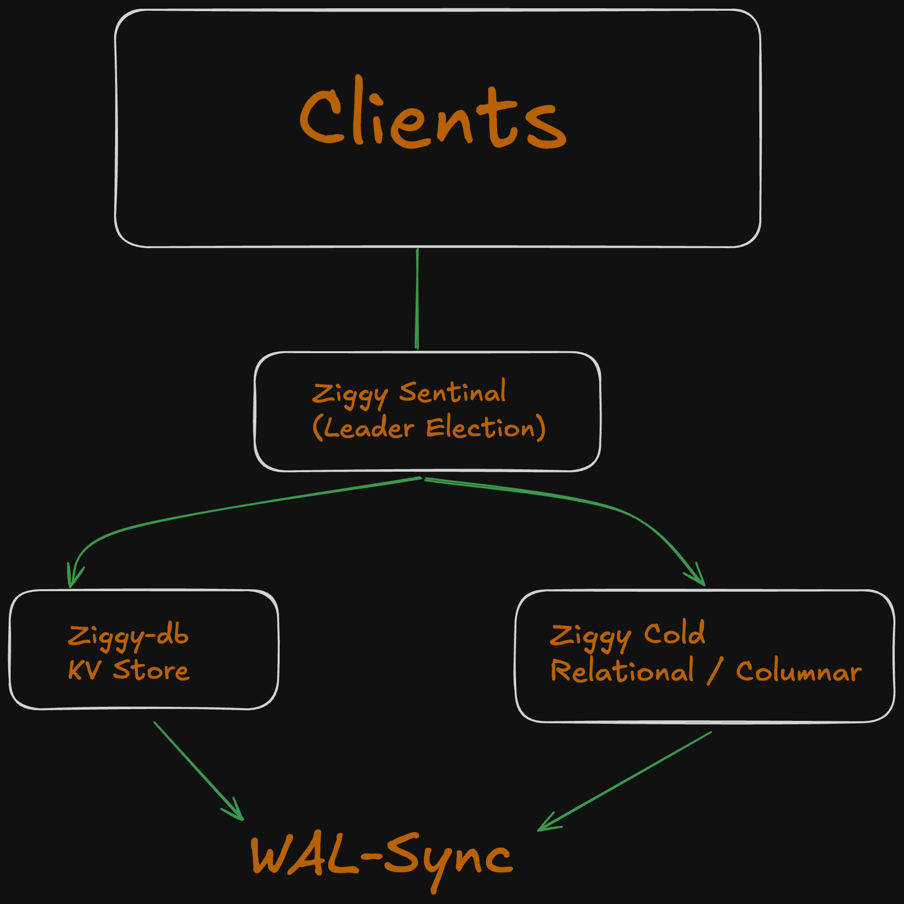

# ZiggyDB

Fast Independent key-value store, with simple interop for cluster context. 

---

## The Convergent Database Approach

Traditional kv stores are used alongside traditional DBs. Making the setup process twice the headache, making sure your cache layer talks to the proper table. It's a nightmare. 

> What if the kv-store just host a relational [Sentinel](https://redis.io/learn/operate/redis-at-scale/high-availability/understanding-sentinels) ?

This would make it so that the developer never has to worry about the relational counterpart, and only the cluster in which the kv-store is located in.

## Installation

> PANIC: TODO:

## Bindings

> PANIC: TODO

- [ ] Rust
- [ ] C++
- [ ] Go

## Contributing 

As this is a large project all contributions are welcome, I will try to put some issues marked `contributer_friendly`. Hopefully they should lay out some conceptual ideas, to
make this complicated problem easier.
